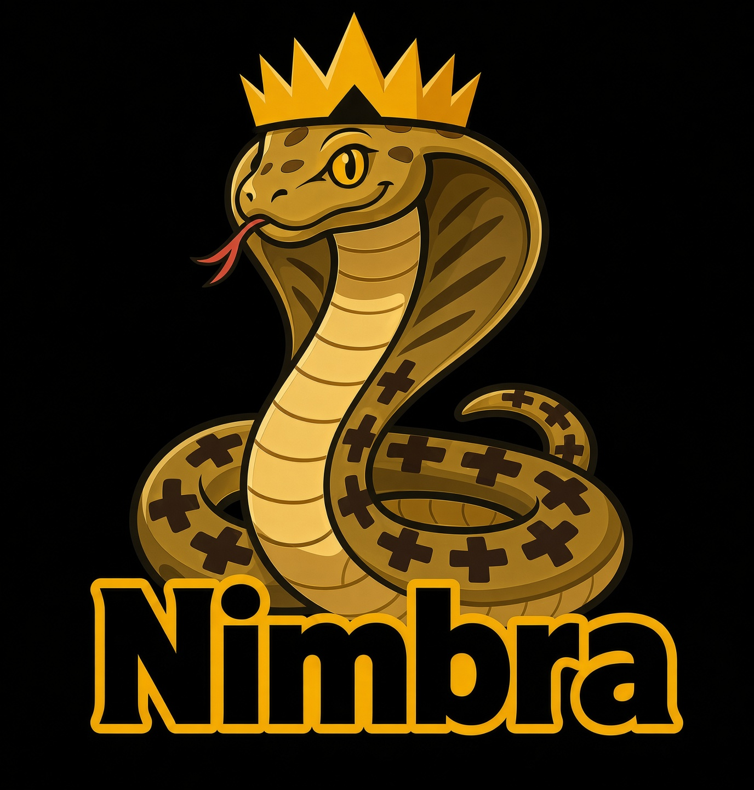

# 🌐 Language / Язык
[🇺🇸 English](#english) | [🇷🇺 Русский](#russian)

---

# 🇺🇸 Nimbra

A library for building CLI applications in Nim, inspired by [Cobra](https://github.com/spf13/cobra) and [Cligen](https://github.com/c-blake/cligen).

## Overview

Key features of the library:

- Simple creation of nested (hierarchical) commands.
- POSIX-compliant argument parser.
- Command aliases.
- Support for two command declaration paradigms:
  1. **Cobra-like**: Explicit command and constructor declaration.
  2. **Cligen-like**: Declarative definition via function signatures using macros.
- Lifecycle hooks similar to Cobra (`PreCommand`, `PostCommand`), with support for "inheritance" via persistent hooks *(Beta: may be unstable)*.
- Support for two error-handling paradigms:
  1. Via exceptions.
  2. Via `Result` type return values.

## Fundamental Concepts

Everything is built upon three core classes: `Command`, `Flag`, and `ArgLimit`.

- **`Command`**: The base class for a command, capable of having child subcommands.
- **`Flag`**: Represents a command-line flag. Supports aliases for long names and can be inherited (persistent).
- **`ArgLimit`**: Defines constraints on the number of positional arguments.

## Roadmap

- [ ] Add support for using asynchronous (`async`) functions as executable commands.
- [ ] Add `{.aliases.}` pragma support for aliases when using `defineCommand`.
- [ ] Add automatic generation of the `--help` flag and its content without explicit declaration.
- [ ] Add shell autocompletion support for `zsh`, `fish`, `bash`, and `pwsh`.
- [ ] Add optional autocompletion support for `nushell`.

> *Note for contributors: When updating this README, please keep both English and Russian versions in sync.*

---

# 🇷🇺 Nimbra

Библиотека для написания CLI-приложений на Nim, вдохновленная [Cobra](https://github.com/spf13/cobra) и [Cligen](https://github.com/c-blake/cligen).

## Обзор

Основные функции библиотеки:

- Простое создание вложенных (иерархических) команд.
- POSIX-совместимый парсер аргументов.
- Псевдонимы (aliases) для команд.
- Совмещение двух способов объявления команд:
  1. **Cobra-like**: явное объявление команд и конструкторов.
  2. **Cligen-like**: декларативное описание по сигнатуре функций через макросы.
- Функции-хуки с привязкой к жизненному циклу программы на манер Cobra (`PreCommand`, `PostCommand`) с возможностью "наследования" через persistent-версии *(Бета: может быть нестабильна)*.
- Поддержка двух парадигм обработки ошибок:
  1. Через исключения.
  2. Через возвращаемое значение с типом `Result`.

## Фундаментальные концепции

Всё базируется на трех основных классах: `Command`, `Flag` и `ArgLimit`.

- **`Command`**: базовый класс команды, поддерживающий дочерние элементы в виде подкоманд.
- **`Flag`**: репрезентация флага. Поддерживает псевдонимы для длинных имен и может быть наследуемым (persistent).
- **`ArgLimit`**: ограничение количества позиционных аргументов.

## Планы на будущее

- [ ] Добавить возможность использования асинхронных (`async`) функций как исполняемых команд.
- [ ] Добавить прагму `{.aliases.}` для псевдонимов при использовании `defineCommand`.
- [ ] Добавить автогенерацию флага `--help` и его содержимого без явного указания.
- [ ] Добавить поддержку автодополнения в `zsh`, `fish`, `bash` и `pwsh`.
- [ ] Добавить поддержку автодополнения в `nushell` (опционально).

> *Примечание для контрибьюторов: При обновлении этого файла, пожалуйста, синхронизируйте изменения в английской и русской версиях.*